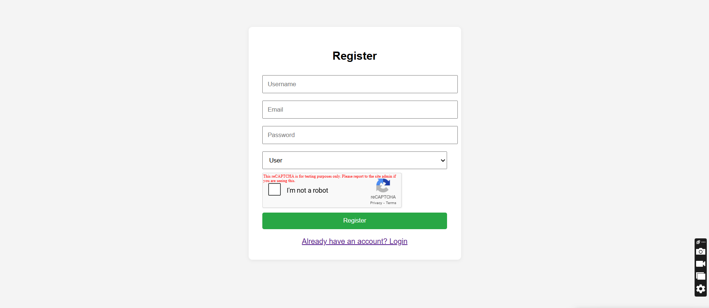
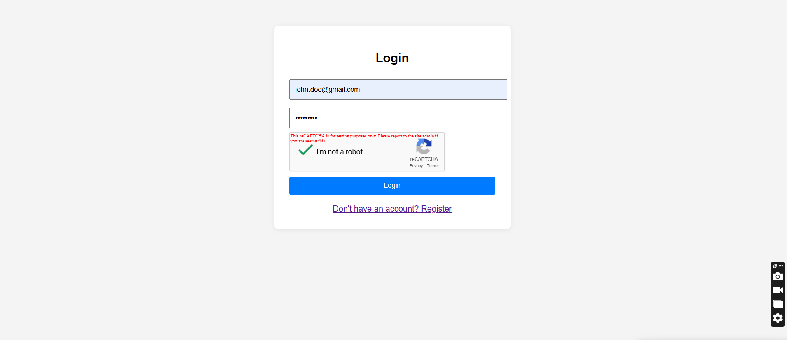
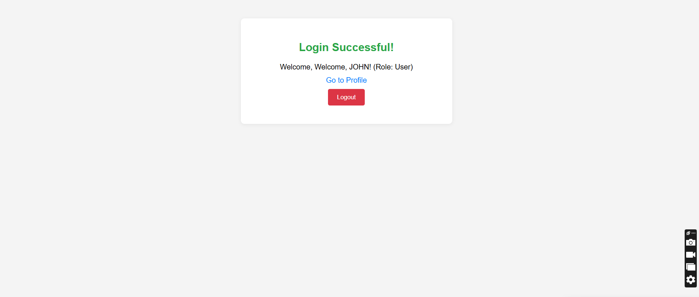
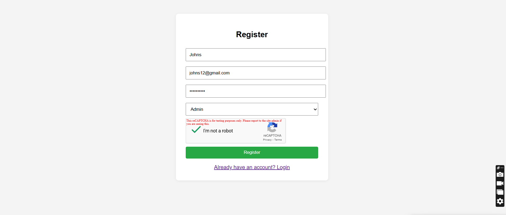
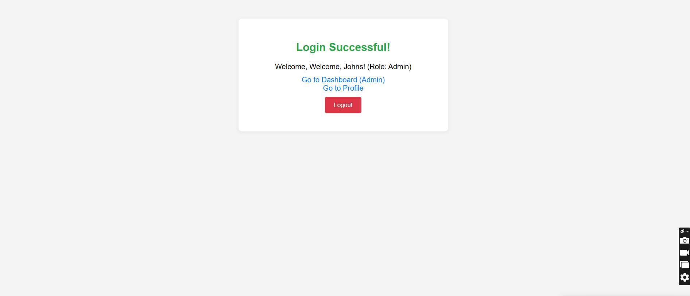
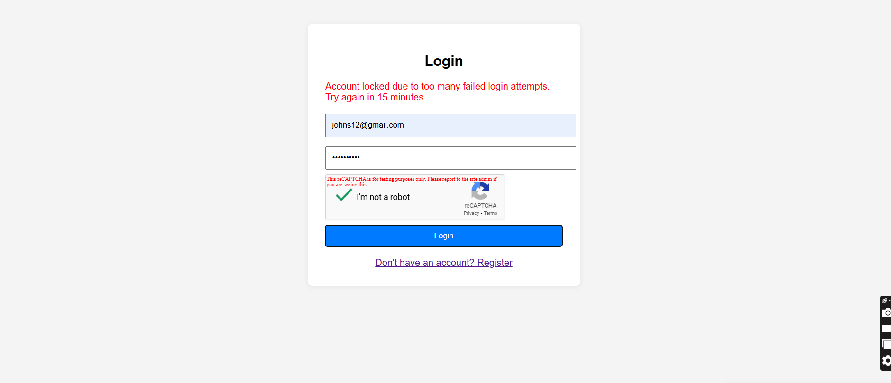
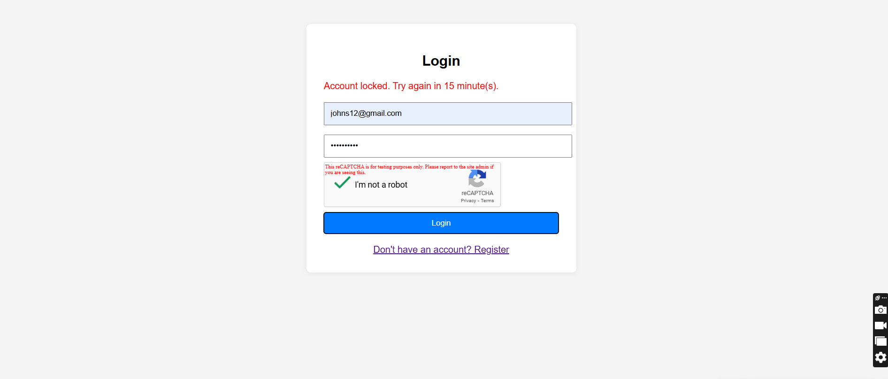

# Secure Login System Backend

## Project Overview
This project is a secure backend for a login system built with Node.js, Express, and MongoDB. It features:
- User registration and login with JWT authentication
- Role-based access control (User/Admin)
- Google reCAPTCHA v2 integration to prevent brute force attacks
- Account lockout after 5 failed login attempts (locks for 15 minutes)
- Simple HTML/JS frontend for registration, login, and dashboard

## Setup Instructions

1. **Clone the repository:**
   ```sh
   git clone https://github.com/Aadhi1302/project-backend-secure-login-system.git
   cd project-backend-secure-login-system
   ```

2. **Install dependencies:**
   ```sh
   npm install
   ```

3. **Configure environment variables:**
   - Create a `.env` file in the root directory with the following:
     ```env
     MONGO_URI=<your-mongodb-connection-string>
     RECAPTCHA_SECRET_KEY=<your-recaptcha-secret-key>
     PORT=3000
     ```
   - Make sure your MongoDB Atlas cluster allows your current IP address.

4. **Run the server:**
   ```sh
   npm run dev
   # or
   node server.js
   ```

5. **Access the frontend:**
   - Open your browser and go to:
     - `http://localhost:3000/register.html` (Register)
     - `http://localhost:3000/login.html` (Login)
     - `http://localhost:3000/success.html` (After login)
     - `http://localhost:3000/dashboard.html` (Admin dashboard)

## Screenshots

> 
> 
> 
> 
> 
> 
> 

## Challenges Faced & Solutions

- **CAPTCHA Integration:**
  - Challenge: Ensuring only real users can register/login.
  - Solution: Integrated Google reCAPTCHA v2 on both forms and verified on the backend.

- **Account Lockout:**
  - Challenge: Preventing brute force attacks.
  - Solution: Tracked failed login attempts in the user model and locked accounts for 15 minutes after 5 failures.

- **Database Connectivity:**
  - Challenge: MongoDB Atlas connection issues due to IP whitelisting.
  - Solution: Added current IP to Atlas Network Access and verified connection string in `.env`.

- **Frontend/Backend Integration:**
  - Challenge: Handling CORS and static file serving.
  - Solution: Used Express static middleware and ensured API endpoints and static files do not conflict.


